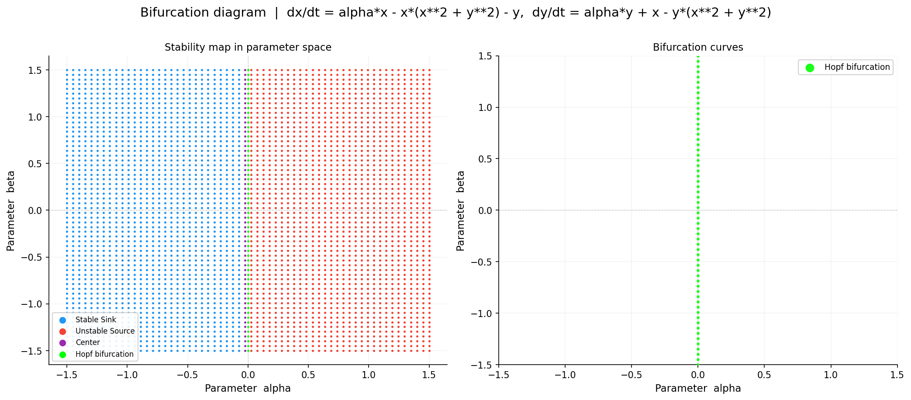
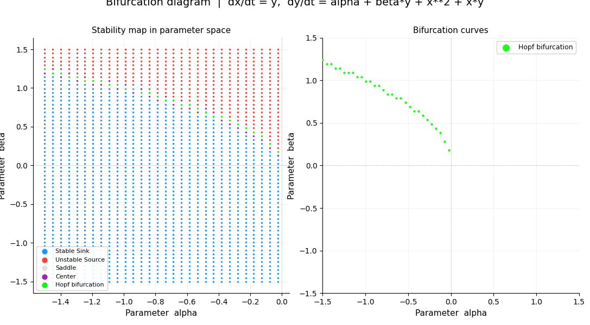

# Automated Bifurcation Analysis of Two-Parameter Dynamical Systems

A computational tool that automates detection and visualization of bifurcations
in two-parameter families of two-dimensional first-order dynamical systems.

**Attribution**: The accompanying report (April 2026) is co-authored with
Tristan Mihocko and Krishna Patel. All code, mathematical derivation, and implementation in this
repository were done independently by Elijah Otaner.

## Problem

For a system
```
dx/dt = f(x, y, alpha, beta)
dy/dt = g(x, y, alpha, beta)
```
a **bifurcation** is a parameter value at which a small change in `alpha` or
`beta` causes a qualitative change in the system's long-term behavior.
Finding these points by hand, across a full 2D parameter space, is tedious
and error-prone. This tool automates the search.

## Method

1. **Symbolic setup** — the user defines `f` and `g` as SymPy expressions.
   The Jacobian is computed symbolically (`sp.diff`) and converted to fast
   NumPy-backed functions (`sp.lambdify`).
2. **Parameter sweep** — the tool sweeps a grid of `(alpha, beta)` values.
3. **Equilibrium finding** — at each grid point, `scipy.optimize.fsolve` is
   run from multiple initial conditions to locate all equilibria (fsolve is
   a local root finder, so a single starting point can miss solutions).
4. **Stability classification** — at each equilibrium, the Jacobian's
   eigenvalues (`numpy.linalg.eigvals`) determine the classification:

   | Eigenvalues | Classification |
   |---|---|
   | Both Re(λ) < 0 | Stable sink |
   | Both Re(λ) > 0 | Unstable source |
   | Re(λ) opposite sign | Saddle |
   | Re(λ) ≈ 0, Im(λ) ≠ 0 | Hopf bifurcation |
   | Re(λ) ≈ 0, Im(λ) ≈ 0 | Saddle-node bifurcation |

5. **Visualization** — a two-panel diagram: a full stability map, and an
   isolated view of just the detected bifurcation curves.

## Results

Validated against two systems with known analytic bifurcation structure:

- **Hopf normal form** (`dx/dt = αx − y − x(x²+y²)`, `dy/dt = x + αy − y(x²+y²)`) —
  tool correctly recovers the Hopf bifurcation line **α = 0**.

  

- **Bogdanov-Takens system** (`dx/dt = y`, `dy/dt = α + βy + x² + xy`) —
  tool correctly recovers the curved Hopf bifurcation boundary **β = √(−α)**.

  

## Limitations (honest assessment)

- **Grid resolution sensitivity**: the classification tolerance is derived
  from grid spacing (`tol = max(Δα, Δβ) / 2`), so whether a point counts as
  a bifurcation depends on how fine the sweep grid is, not on a fixed
  numerical threshold.
- **Saddle-node detection was not successfully demonstrated.** It requires
  an eigenvalue to be almost exactly zero, which a discrete grid will rarely
  land on exactly — this is a direct consequence of the grid-based approach
  above, not an independent bug.
- **Scope**: only 2D, first-order, two-parameter systems; only Hopf and
  saddle-node bifurcations are detected.

## Usage

Edit the "Configuration" section at the bottom of `bifurcation_finder.py`
to define a new system (as SymPy expressions), set parameter/search ranges,
and run:

```bash
python bifurcation_finder.py
```

This prints sweep progress and saves `bifurcation_diagram.png`.

**Dependencies**: `numpy`, `scipy`, `sympy`, `matplotlib`

## Full report

See [`FinalizedBifurcationsReport.pdf`](./FinalizedBifurcationsReport.pdf) for
the full mathematical derivation (Jacobian linearization, eigenvalue-based
classification, Hopf/saddle-node conditions) and discussion.
